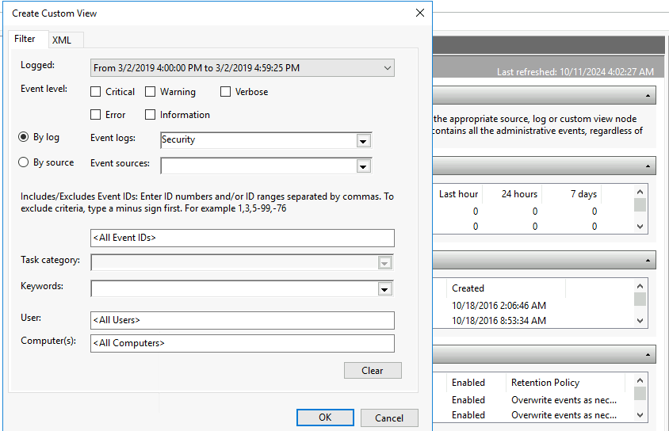

+++
title = "Investigating Windows - TryHackMe Writup"
description = "Investigating the hacked windows machine."
date = 2024-10-23
slug = "investigating-windows"
image = "investigating_windows.png"

[taxonomies]
categories = ["TryHackMe", "Writups"]
tags = ["investigating windows", "tryhackme", "forensics"]
+++

  

    
  

  

    <i>A windows machine has been hacked, its your job to go investigate this windows machine and find clues to what the hacker might have done.</i>
  

Target IP: 10.10.99.65

### 1. Version and year of windows machine
This can be found easily through properties. Also there is command `Get-ComputerInfo -Property "Os*"` for powershell to get inforation. This is Windows S***** 20**

### 2. Last user logged in
First need to get all the users through `Get-LocalUser`, we get
<pre>
Name           Enabled Description
----           ------- -----------
Administrator  True    Built-in account for administering the computer/domain
DefaultAccount False   A user account managed by the system.
Guest          True    Built-in account for guest access to the computer/domain
Jenny          True
John           True
</pre>

Now need to check the last login of each user, and found result as

### 3. When did John log onto the system last?
We already have this answer in above question

### 4. What IP does the system connect to when it first starts?
We need to check system startup connection by using registry editor.

The IP is found in path `HKEY_LOCAL_MACHINE > SOFTWARE > Microsoft > Windows > CurrentVersion > Run`

### 5. What two accounts had administrative privileges (other than the Administrator user)?
We need to find out the user, that are the group member of group `Administrators`

### 6. Whats the name of the scheduled task that is malicous.
Schedule task can be get using command `Get-ScheduledTask`. Now looking into taskpath `\`, we have only 6 tasks. By analyzing one task `Clean **** ******` seems to be malicious.

### 7. What file was the task trying to run daily?
Need to find out the action done by this task. We can find out malicious binaries.
<pre>
$task = Get-ScheduledTask | Where TaskName -EQ "Clean **** ******"
$task.Actions
</pre>
Then we get the binary in Execute variable.

### 8. What port did this file listen locally for?
As the file is using netcat, looking into the argument variable we have the port number `13**`.

### 9. When did Jenny last logon?
We already have the answer.

### 10. At what date did the compromise take place?
This is the malicious file creation date, look into the file properties of above executable file.

### 11. During the compromise, at what time did Windows first assign special privileges to a new logon?
Need to look into event viewer, of the file created date. Then looking into security log of that day. Open `Event Viewer` application and apply filter/search. There from last, look for Task Category `Security Group Management` and we got the date and time.

### 12. What tool was used to get Windows passwords?
By looking into TMP directory, we can findout the tool and it is `mimi****`.

### 13. What was the attackers external control and command servers IP?
Also known as C2 server, used to control the attacker machine from remote area. Need to look into hosts file which is found in the location `C:\Windows\System32\drivers\etc`. At last of the file we got the IP address, wher edomain is set to goodle.com

### 14. What was the extension name of the shell uploaded via the servers website?
Shell should be uploaded via web, so need to look into webroot directory. Lets look into wwwroot dir.
This is in location `C:\inetpub\wwwroot`. The extension is found there.

### 15. What was the last port the attacker opened?
The port should be open for communication and can be found in firewall rule. Lets look into firewall configuration.

Inside Inbound Rules, there is a rule name `Allow outside connection for development`, looking into Protocols and Ports, we have the port opened by attacker as `13**`. 

### 16. Check for DNS poisoning, what site was targeted?
We already have this answer in the hosts file, which is the domain name pointing to the attacker IP.

This CTF covered the simple forensics of a compromised windows server and backtrace to the attacker.

Happy Hacking !!